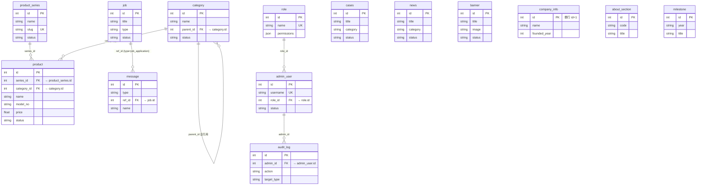

# 数据库设计文档 · Rz家居网站（企业家居官网 + 后台管理系统）

> 版本：v1.1
> 日期：2026-08-17
> 作者：产品管理专家组（Product Management Expert）
> 文档状态：v1.1 架构师审核修订版，待研发评审
> 配套文档：`PRD_企业家居网站.md`(v0.5) · `开发技术文档_Rz家居网站.md`(v1.2) · `UIUX_Rz家居网站.md`(v1.0)

> **说明**：本文档全部权威内容（数据字典、双库建表 SQL、索引、迁移、附录）已完整并入《开发技术文档_Rz家居网站.md》§4，该文件为数据库设计的**唯一来源**。本文件保留作为详版离线参考，二者内容一致，评审以《开发技术文档》为准。

---

## 0. 修订记录

| 版本 | 日期 | 说明 |
|---|---|---|
| v1.0 | 2026-08-17 | 首版数据库设计文档。基于 PRD v0.5 与开发技术文档 v1.2 §4，定义 14 张表：E-R 图（SVG + Mermaid）、数据字典、PostgreSQL / SQLite 双库建表 SQL、索引、迁移与初始化 |
| v1.1 | 2026-08-17 | 软件架构师组长审核修订：① 修复 seed 显式指定 id 导致 SERIAL 序列不前进的主键冲突（改为不指定 id，由序列自分配）；② 修正 `updated_at` 误解（DB 无自动 ON UPDATE，改由 ORM `onupdate` 维护），并为 category/banner 补 `updated_at`；③ 落实「外键必建索引」约定，补 `category.parent_id` / `admin_user.role_id` / `audit_log.admin_id` 索引；④ `message`/`audit_log` 升 `BIGSERIAL`；⑤ 新增 §5.5 性能/安全/扩展性增强建议与附录 D 权限模块枚举 |

---

## 1. 文档说明与一致性声明

### 1.1 依据与范围
- **功能与状态定义**：以 `PRD_企业家居网站.md`(v0.5) 的 §4 前台/后台功能需求、§7 数据模型章节为依据。
- **表结构与字段**：以 `开发技术文档_Rz家居网站.md`(v1.2) §4.2 模型骨架（SQLAlchemy 2.0）为权威来源，本文件将其**逐字落地为数据字典与建表 SQL**。
- **范围**：仅数据库层（结构、约束、字典、SQL、迁移）；不含业务逻辑、接口代码（见开发技术文档 §5）、前端实现（见 UI/UX 文档）。

### 1.2 与既有文档的关系
| 文档 | 本文件中对应关系 |
|---|---|
| PRD §4（功能模块） | 数据字典中各表「业务归属」列 |
| PRD §7（数据模型） | 表 / 字段 / 枚举的源头 |
| 开发技术文档 §4.2（模型骨架） | 本文件数据字典与 SQL 的逐字段来源 |
| 开发技术文档 §12.1（枚举总表） | 本文件附录 A 枚举总表 |
| 开发技术文档 §4.1（ER 图） | 本文件 §3 E-R 图同源 |

### 1.3 双库策略（重申）
- **开发环境**：SQLite（`sqlite:///./rz_home.db`）
- **生产环境**：PostgreSQL 15（`postgresql+psycopg://…`）
- **代码零改动原则**：ORM 统一用 SQLAlchemy 2.0，连接串经环境变量 `DATABASE_URL` 切换；本文件给出的 SQL 仅用于**建库/审阅/初始化**，运行期以 ORM 为准。

---

## 2. 设计原则与数据库约定

### 2.1 命名规范
- 表名：`snake_case`、全小写、英文单数（一个实体一张表）；**避开 SQL 关键字**——案例表命名为 `cases`（非 `case`）。
- 字段：同 `snake_case`；主键统一 `id`；外键统一 `<关联表>_id`（如 `series_id`、`role_id`）；时间统一 `created_at` / `updated_at`。
- 布尔字段 `is_` 前缀（`is_recommended`、`is_new`、`is_top`）。
- 枚举字段用 `status` / `type` / `category` 等短字符串，值用 snake/英文小写。

### 2.2 字符集与时区
- 字符集：`utf8mb4`（MySQL 语义）/ PG `UTF8` / SQLite 默认 UTF-8，确保中文与 emoji 正常。
- 时间：统一 **UTC 存储**（`DateTime(timezone=True)` → PG `TIMESTAMPTZ`、SQLite `TEXT` 存储 UTC 字符串，建议统一为 `YYYY-MM-DDThh:mm:ssZ` 格式以避免歧义）；展示层按访问者时区转换。
- `created_at` 默认 `now()`（UTC）。`updated_at` **不依赖数据库触发器**，由 ORM 层 `onupdate=func.now()` 在 UPDATE 时自动赋值（SQLite 无 `ON UPDATE` 语法、PG 亦不强制；应用层统一维护可保证双库一致）。
- **时间戳约定例外**（系统/审计类表）：`message` 用 `replied_at` 表征最后活动时间；`admin_user` 用 `last_login_at`；`audit_log` 仅 `created_at`（写入后不可变）；`role` 为低频系统配置、不加时间戳。内容类表（product_series / category / product / cases / news / job / banner / company_info / about_section / milestone）统一携带 `updated_at`。

### 2.3 枚举与约束
- **枚举值在应用层（Pydantic）校验，不在数据库层建 CHECK**——确保 SQLite 与 PostgreSQL 行为一致（与开发技术文档 §4.3 一致）。
- 唯一约束在数据库层建立：`slug`（series/category）、`username`、`role.name`、`company_info` 单行（应用层保障 id=1）。
- 外键开启级联限制：`ON DELETE RESTRICT`（PG）/ `PRAGMA foreign_keys=ON`（SQLite），避免误删主数据。

### 2.4 特殊字段处理
- **JSON 字段**（`images`、`specs`、`permissions`）：PG 用 `JSONB`，SQLite 用 `TEXT`（存储 JSON 字符串），ORM `JSON` 类型透明处理。
- **富文本**（`product.description`、`news.content`、`message.content` 等）：存储已净化的 HTML 字符串（见开发技术文档 §8 净化约定）。
- **自增主键**：PG `SERIAL`/`BIGSERIAL`，SQLite `INTEGER PRIMARY KEY AUTOINCREMENT`。
- **软删除**：统一用 `status` 字段标记（如 `active`/`hidden`、`draft`/`published`、`new`/`handled`/`ignored`、`active`/`disabled`），**不做物理删除**；统计/展示仅读取有效状态。

### 2.5 索引策略
- 所有外键列建索引。
- 高频列表/筛选列建索引：`status`、`type`、`category`、`created_at`。
- 唯一键自动建索引（`slug`、`username`、`role.name`）。

---

## 3. E-R 图

> 按「业务核心域 / 互动与内容域 / 权限与安全域」三个域分组绘制：先用 Mermaid `erDiagram` 描述 14 实体与关系，再转换为独立 SVG 图片（`assets/db_er.svg`）。下方同时给出 SVG 图片与 Mermaid 源码，便于版本管理与二次编辑。


### 3.1 Mermaid 源码



---

## 4. 数据字典

> 字段类型标注为**逻辑类型**；具体物理类型见 §5 建表 SQL。
> 约束缩写：PK=主键，FK=外键，NN=非空，UQ=唯一，IX=索引，DFT=默认值。

### 4.1 product_series（产品系列）

| 字段名 | 类型(长度) | 必值 | 默认值 | 主键 | 外键 | 索引 | 说明 | 枚举/约束 |
|---|---|---|---|---|---|---|---|---|
| id | INT | 是 | — | PK | — | 是 | 系列 ID | AUTO_INCREMENT |
| name | VARCHAR(120) | 是 | — | — | — | — | 系列名称（如 胡桃禮、如意春） | — |
| slug | VARCHAR(160) | 是 | — | — | — | 是 | 英文短链标识，SEO 友好 | UNIQUE |
| description | TEXT | 否 | NULL | — | — | — | 系列描述 | — |
| cover_image | VARCHAR(512) | 否 | NULL | — | — | — | 封面图 URL | — |
| sort_order | INT | 否 | 0 | — | — | — | 排序权重（小靠前） | — |
| status | VARCHAR(20) | 否 | active | — | — | 是 | 状态标识 | active\|hidden |

- **业务归属**：PRD §4.2 产品中心 / 系列列表；管理接口 `/api/admin/product-series`。
- **枚举**：status ∈ {active, hidden}。
- **示例**：`(1, '胡桃禮', 'walnut-ritual', '新中式实木系列', '/img/...', 0, 'active')`

### 4.2 category（空间分类）

| 字段名 | 类型(长度) | 必值 | 默认值 | 主键 | 外键 | 索引 | 说明 | 枚举/约束 |
|---|---|---|---|---|---|---|---|---|
| id | INT | 是 | — | PK | — | 是 | 分类 ID | AUTO_INCREMENT |
| name | VARCHAR(120) | 是 | — | — | — | — | 分类名（客厅/卧室/书房/茶室/餐厅） | — |
| slug | VARCHAR(160) | 是 | — | — | — | 是 | 短链标识 | UNIQUE |
| parent_id | INT | 否 | NULL | — | category.id | — | 父分类（自引用，支持多级） | FOREIGN KEY → category.id |
| sort_order | INT | 否 | 0 | — | — | — | 排序 | — |
| status | VARCHAR(20) | 否 | active | — | — | 是 | 状态标识 | active\|hidden |
| updated_at | TIMESTAMPTZ | 否 | now() | — | — | — | 更新时间 | — |

- **业务归属**：PRD §4.2 产品中心空间筛选；`parent_id` 支持二级分类（如 客厅 → 沙发）。
- **枚举**：status ∈ {active, hidden}。

### 4.3 product（产品）

| 字段名 | 类型(长度) | 必值 | 默认值 | 主键 | 外键 | 索引 | 说明 | 枚举/约束 |
|---|---|---|---|---|---|---|---|---|
| id | INT | 是 | — | PK | — | 是 | 产品 ID | AUTO_INCREMENT |
| series_id | INT | 否 | NULL | — | product_series.id | 是 | 所属系列 | FOREIGN KEY → product_series.id |
| category_id | INT | 否 | NULL | — | category.id | 是 | 所属空间分类 | FOREIGN KEY → category.id |
| name | VARCHAR(200) | 是 | — | — | — | — | 产品名称 | — |
| model_no | VARCHAR(80) | 否 | NULL | — | — | — | 型号 | — |
| summary | TEXT | 否 | NULL | — | — | — | 简介 | — |
| description | TEXT | 否 | NULL | — | — | — | 详情（净化 HTML） | — |
| images | JSON | 否 | [] | — | — | — | 图集 URL 数组 | — |
| specs | JSON | 否 | {} | — | — | — | 规格键值对（材质/尺寸…） | — |
| price | FLOAT | 否 | NULL | — | — | — | 展示参考价（非交易） | — |
| is_recommended | BOOLEAN | 否 | false | — | — | — | 是否首页推荐 | — |
| status | VARCHAR(20) | 否 | active | — | — | 是 | 状态标识 | active\|hidden |
| created_at | TIMESTAMPTZ | 否 | now() | — | — | — | 创建时间 | — |
| updated_at | TIMESTAMPTZ | 否 | now() | — | — | — | 更新时间 | — |

- **业务归属**：PRD §4.2 产品中心列表/详情；前台 `/products`。
- **枚举**：status ∈ {active, hidden}。
- **索引**：series_id、category_id、status。

### 4.4 cases（案例，表名避关键字）

| 字段名 | 类型(长度) | 必值 | 默认值 | 主键 | 外键 | 索引 | 说明 | 枚举/约束 |
|---|---|---|---|---|---|---|---|---|
| id | INT | 是 | — | PK | — | 是 | 案例 ID | AUTO_INCREMENT |
| title | VARCHAR(200) | 是 | — | — | — | — | 案例标题 | — |
| category | VARCHAR(20) | 否 | 住宅 | — | — | 是 | 分类标识 | 住宅\|工程\|商业 |
| cover_image | VARCHAR(512) | 否 | NULL | — | — | — | 封面 | — |
| images | JSON | 否 | [] | — | — | — | 图集 | — |
| summary | TEXT | 否 | NULL | — | — | — | 摘要 | — |
| content | TEXT | 否 | NULL | — | — | — | 正文 | — |
| is_new | BOOLEAN | 否 | false | — | — | — | 是否标记「新」 | — |
| sort_order | INT | 否 | 0 | — | — | — | 排序 | — |
| status | VARCHAR(20) | 否 | active | — | — | 是 | 状态标识 | active\|hidden |
| created_at | TIMESTAMPTZ | 否 | now() | — | — | — | 创建时间 | — |
| updated_at | TIMESTAMPTZ | 否 | now() | — | — | — | 更新时间 | — |

- **业务归属**：PRD §4.3 新案例展示；表名 `cases`（避开 SQL 关键字 `case`）。
- **枚举**：category ∈ {住宅, 工程, 商业}；status ∈ {active, hidden}。

### 4.5 news（新闻资讯）

| 字段名 | 类型(长度) | 必值 | 默认值 | 主键 | 外键 | 索引 | 说明 | 枚举/约束 |
|---|---|---|---|---|---|---|---|---|
| id | INT | 是 | — | PK | — | 是 | 新闻 ID | AUTO_INCREMENT |
| title | VARCHAR(200) | 是 | — | — | — | — | 标题 | — |
| category | VARCHAR(20) | 否 | company | — | — | 是 | 分类标识 | company\|industry |
| cover_image | VARCHAR(512) | 否 | NULL | — | — | — | 封面 | — |
| summary | TEXT | 否 | NULL | — | — | — | 摘要 | — |
| content | TEXT | 否 | NULL | — | — | — | 正文（净化 HTML） | — |
| author | VARCHAR(80) | 否 | NULL | — | — | — | 作者 | — |
| published_at | TIMESTAMPTZ | 否 | NULL | — | — | — | 发布时间 | — |
| is_top | BOOLEAN | 否 | false | — | — | — | 是否置顶 | — |
| status | VARCHAR(20) | 否 | draft | — | — | 是 | 状态标识 | draft\|published |
| created_at | TIMESTAMPTZ | 否 | now() | — | — | — | 创建时间 | — |
| updated_at | TIMESTAMPTZ | 否 | now() | — | — | — | 更新时间 | — |

- **业务归属**：PRD §4.4 新闻（企业新闻/行业资讯，由 category 区分）。
- **枚举**：category ∈ {company, industry}；status ∈ {draft, published}。

### 4.6 job（招聘职位）

| 字段名 | 类型(长度) | 必值 | 默认值 | 主键 | 外键 | 索引 | 说明 | 枚举/约束 |
|---|---|---|---|---|---|---|---|---|
| id | INT | 是 | — | PK | — | 是 | 职位 ID | AUTO_INCREMENT |
| type | VARCHAR(20) | 否 | social | — | — | 是 | 类型标识 | social\|campus |
| title | VARCHAR(200) | 是 | — | — | — | — | 职位名称 | — |
| department | VARCHAR(80) | 否 | NULL | — | — | — | 部门 | — |
| city | VARCHAR(80) | 否 | NULL | — | — | — | 工作城市 | — |
| salary | VARCHAR(80) | 否 | NULL | — | — | — | 薪资（展示文本/区间） | — |
| description | TEXT | 否 | NULL | — | — | — | 职责描述 | — |
| requirements | TEXT | 否 | NULL | — | — | — | 任职要求 | — |
| headcount | INT | 否 | NULL | — | — | — | 招聘人数 | — |
| status | VARCHAR(20) | 否 | active | — | — | 是 | 状态标识 | active\|hidden |
| publish_at | TIMESTAMPTZ | 否 | NULL | — | — | — | 发布时间 | — |
| created_at | TIMESTAMPTZ | 否 | now() | — | — | — | 创建时间 | — |
| updated_at | TIMESTAMPTZ | 否 | now() | — | — | — | 更新时间 | — |

- **业务归属**：PRD §4.5 招聘入口（社会/校园，由 type 区分）；职位详情「投递意向」写入 `message`。
- **枚举**：type ∈ {social, campus}；status ∈ {active, hidden}。

### 4.7 message（留言 / 线索）

| 字段名 | 类型(长度) | 必值 | 默认值 | 主键 | 外键 | 索引 | 说明 | 枚举/约束 |
|---|---|---|---|---|---|---|---|---|
| id | INT | 是 | — | PK | — | 是 | 留言 ID | AUTO_INCREMENT |
| type | VARCHAR(20) | 否 | contact | — | — | 是 | 类型标识 | contact\|job_application |
| ref_id | INT | 否 | NULL | — | — | 是 | type=job_application 时 = job.id | — |
| name | VARCHAR(80) | 是 | — | — | — | — | 姓名 | — |
| phone | VARCHAR(40) | 是 | — | — | — | — | 电话 | — |
| email | VARCHAR(160) | 否 | NULL | — | — | — | 邮箱 | — |
| content | TEXT | 是 | — | — | — | — | 留言内容 | — |
| status | VARCHAR(20) | 否 | new | — | — | 是 | 状态标识 | new\|handled\|ignored |
| reply | TEXT | 否 | NULL | — | — | — | 回复内容 | — |
| replied_at | TIMESTAMPTZ | 否 | NULL | — | — | — | 回复时间 | — |
| created_at | TIMESTAMPTZ | 否 | now() | — | — | 是 | 提交时间 | — |

- **业务归属**：PRD §4.5/§4.6 联系我们 + 应聘留言；后台留言管理（联系/应聘分类）。
- **关键关系**：`type=job_application` 时 `ref_id` → `job.id`（HR 在后台可见关联职位）。
- **枚举**：type ∈ {contact, job_application}；status ∈ {new, handled, ignored}。

### 4.8 banner（轮播图）

| 字段名 | 类型(长度) | 必值 | 默认值 | 主键 | 外键 | 索引 | 说明 | 枚举/约束 |
|---|---|---|---|---|---|---|---|---|
| id | INT | 是 | — | PK | — | 是 | 轮播 ID | AUTO_INCREMENT |
| title | VARCHAR(200) | 是 | — | — | — | — | 标题 | — |
| image | VARCHAR(512) | 是 | — | — | — | — | 图片 URL | — |
| link_url | VARCHAR(512) | 否 | NULL | — | — | — | 点击跳转链接 | — |
| sort_order | INT | 否 | 0 | — | — | — | 排序 | — |
| status | VARCHAR(20) | 否 | active | — | — | 是 | 状态标识 | active\|hidden |
| start_time | TIMESTAMPTZ | 否 | NULL | — | — | — | 上架时间 | — |
| end_time | TIMESTAMPTZ | 否 | NULL | — | — | — | 下架时间 | — |
| created_at | TIMESTAMPTZ | 否 | now() | — | — | — | 创建时间 | — |
| updated_at | TIMESTAMPTZ | 否 | now() | — | — | — | 更新时间 | — |

- **业务归属**：PRD §4.1 首页轮播；管理接口 `/api/admin/banners`。
- **枚举**：status ∈ {active, hidden}。

### 4.9 company_info（公司信息，单行配置）

| 字段名 | 类型(长度) | 必值 | 默认值 | 主键 | 外键 | 索引 | 说明 | 枚举/约束 |
|---|---|---|---|---|---|---|---|---|
| id | INT | 是 | — | PK | — | 是 | 固定 =1 | AUTO_INCREMENT |
| name | VARCHAR(200) | 否 | 'Rz家居' | — | — | — | 公司/品牌名 | — |
| logo_url | VARCHAR(512) | 否 | NULL | — | — | — | Logo | — |
| founded_year | INT | 否 | NULL | — | — | — | 建厂/成立年份 | — |
| honor_count | INT | 否 | NULL | — | — | — | 荣誉数量 | — |
| production_line_count | INT | 否 | NULL | — | — | — | 智能化生产线数 | — |
| address | VARCHAR(300) | 否 | NULL | — | — | — | 地址 | — |
| phone | VARCHAR(40) | 否 | NULL | — | — | — | 联系电话 | — |
| email | VARCHAR(160) | 否 | NULL | — | — | — | 邮箱 | — |
| wechat | VARCHAR(80) | 否 | NULL | — | — | — | 微信公众号 | — |
| icp_no | VARCHAR(40) | 否 | NULL | — | — | — | ICP 备案号 | — |
| intro | TEXT | 否 | NULL | — | — | — | 公司简介 | — |
| updated_at | TIMESTAMPTZ | 否 | now() | — | — | — | 更新时间 | — |

- **业务归属**：PRD §4.1 企业实力数据 / §4.6 联系我们；首页与联系页统一读取此表。
- **约定**：单行配置，应用层保障仅 id=1 一条。

### 4.10 about_section（关于我们区块）

| 字段名 | 类型(长度) | 必值 | 默认值 | 主键 | 外键 | 索引 | 说明 | 枚举/约束 |
|---|---|---|---|---|---|---|---|---|
| id | INT | 是 | — | PK | — | 是 | 区块 ID | AUTO_INCREMENT |
| code | VARCHAR(20) | 是 | — | — | — | 是 | 区块编码 | overview\|brand |
| title | VARCHAR(200) | 是 | — | — | — | — | 区块标题 | — |
| content | TEXT | 否 | NULL | — | — | — | 区块内容（净化 HTML） | — |
| cover_image | VARCHAR(512) | 否 | NULL | — | — | — | 配图 | — |
| sort_order | INT | 否 | 0 | — | — | — | 排序 | — |
| status | VARCHAR(20) | 否 | active | — | — | 是 | 状态标识 | active\|hidden |
| updated_at | TIMESTAMPTZ | 否 | now() | — | — | — | 更新时间 | — |

- **业务归属**：PRD §4.6 关于Rz（code=overview）/ 品牌介绍（code=brand）；由后台「关于我们配置」维护。
- **枚举**：code ∈ {overview, brand}；status ∈ {active, hidden}。

### 4.11 milestone（发展历程）

| 字段名 | 类型(长度) | 必值 | 默认值 | 主键 | 外键 | 索引 | 说明 | 枚举/约束 |
|---|---|---|---|---|---|---|---|---|
| id | INT | 是 | — | PK | — | 是 | 里程碑 ID | AUTO_INCREMENT |
| year | VARCHAR(20) | 是 | — | — | — | — | 年份（如 1953 / 2020s） | — |
| title | VARCHAR(200) | 是 | — | — | — | — | 标题 | — |
| description | TEXT | 否 | NULL | — | — | — | 描述 | — |
| image | VARCHAR(512) | 否 | NULL | — | — | — | 配图 | — |
| sort_order | INT | 否 | 0 | — | — | — | 时间轴顺序 | — |
| status | VARCHAR(20) | 否 | active | — | — | 是 | 状态标识 | active\|hidden |
| created_at | TIMESTAMPTZ | 否 | now() | — | — | — | 创建时间 | — |
| updated_at | TIMESTAMPTZ | 否 | now() | — | — | — | 更新时间 | — |

- **业务归属**：PRD §4.6 发展历程时间轴。
- **枚举**：status ∈ {active, hidden}。

### 4.12 role（角色）

| 字段名 | 类型(长度) | 必值 | 默认值 | 主键 | 外键 | 索引 | 说明 | 枚举/约束 |
|---|---|---|---|---|---|---|---|---|
| id | INT | 是 | — | PK | — | 是 | 角色 ID | AUTO_INCREMENT |
| name | VARCHAR(80) | 是 | — | — | — | 是 | 名称 | UNIQUE, super_admin\|editor\|cs_hr |
| permissions | JSON | 否 | {} | — | — | — | 权限矩阵 {模块:[read,write]} | — |

- **业务归属**：开发技术文档 §7.4 三角色权限；`permissions` 形如 `{"products":["read","write"],"messages":["read","write"]}`。
- **枚举**：name ∈ {super_admin, editor, cs_hr}。
- **预置**：super_admin（全量）、editor（展示型内容）、cs_hr（线索型内容+招聘）。

### 4.13 admin_user（管理员）

| 字段名 | 类型(长度) | 必值 | 默认值 | 主键 | 外键 | 索引 | 说明 | 枚举/约束 |
|---|---|---|---|---|---|---|---|---|
| id | INT | 是 | — | PK | — | 是 | 管理员 ID | AUTO_INCREMENT |
| username | VARCHAR(80) | 是 | — | — | — | 是 | 登录名 | UNIQUE |
| password_hash | VARCHAR(255) | 是 | — | — | — | — | bcrypt 哈希（cost≥12） | — |
| display_name | VARCHAR(120) | 否 | NULL | — | — | — | 显示名 | — |
| role_id | INT | 是 | — | — | role.id | — | 角色 | FOREIGN KEY → role.id |
| status | VARCHAR(20) | 否 | active | — | — | 是 | 状态标识 | active\|disabled |
| last_login_at | TIMESTAMPTZ | 否 | NULL | — | — | — | 最近登录 | — |
| created_at | TIMESTAMPTZ | 否 | now() | — | — | — | 创建时间 | — |

- **业务归属**：开发技术文档 §5.1 登录与权限；`role_id` 决定菜单与操作边界。
- **枚举**：status ∈ {active, disabled}。

### 4.14 audit_log（审计日志，P1）

| 字段名 | 类型(长度) | 必值 | 默认值 | 主键 | 外键 | 索引 | 说明 | 枚举/约束 |
|---|---|---|---|---|---|---|---|---|
| id | INT | 是 | — | PK | — | 是 | 日志 ID | AUTO_INCREMENT |
| admin_id | INT | 否 | NULL | — | admin_user.id | — | 操作人 | FOREIGN KEY → admin_user.id |
| action | VARCHAR(40) | 是 | — | — | — | — | 操作类型 | create\|update\|delete\|login |
| target_type | VARCHAR(40) | 否 | NULL | — | — | — | 对象类型（如 product） | — |
| target_id | INT | 否 | NULL | — | — | — | 对象 ID | — |
| detail | TEXT | 否 | NULL | — | — | — | 变更摘要 | — |
| created_at | TIMESTAMPTZ | 否 | now() | — | — | 是 | 操作时间 | — |

- **业务归属**：开发技术文档 §9 合规审计；P1 落库（建表但 v1 可仅记录登录与关键写操作）。
- **枚举**：action ∈ {create, update, delete, login}。

---

## 5. 建表 SQL

### 5.1 生产环境 PostgreSQL DDL（权威版）

```sql
-- ============ 内容 / 展示 ============
CREATE TABLE product_series (
    id            SERIAL PRIMARY KEY,
    name          VARCHAR(120) NOT NULL,
    slug          VARCHAR(160) NOT NULL UNIQUE,
    description   TEXT,
    cover_image   VARCHAR(512),
    sort_order    INTEGER DEFAULT 0,
    status        VARCHAR(20) DEFAULT 'active',
    created_at    TIMESTAMPTZ DEFAULT now(),
    updated_at    TIMESTAMPTZ DEFAULT now()
);
CREATE INDEX ix_product_series_status ON product_series(status);

CREATE TABLE category (
    id            SERIAL PRIMARY KEY,
    name          VARCHAR(120) NOT NULL,
    slug          VARCHAR(160) NOT NULL UNIQUE,
    parent_id     INTEGER REFERENCES category(id) ON DELETE RESTRICT,
    sort_order    INTEGER DEFAULT 0,
    status        VARCHAR(20) DEFAULT 'active',
    created_at    TIMESTAMPTZ DEFAULT now(),
    updated_at    TIMESTAMPTZ DEFAULT now()
);
CREATE INDEX ix_category_status ON category(status);
CREATE INDEX ix_category_parent_id ON category(parent_id);

CREATE TABLE product (
    id            SERIAL PRIMARY KEY,
    series_id     INTEGER REFERENCES product_series(id) ON DELETE RESTRICT,
    category_id   INTEGER REFERENCES category(id) ON DELETE RESTRICT,
    name          VARCHAR(200) NOT NULL,
    model_no      VARCHAR(80),
    summary       TEXT,
    description   TEXT,
    images        JSONB DEFAULT '[]'::jsonb,
    specs         JSONB DEFAULT '{}'::jsonb,
    price         DOUBLE PRECISION,
    is_recommended BOOLEAN DEFAULT false,
    status        VARCHAR(20) DEFAULT 'active',
    created_at    TIMESTAMPTZ DEFAULT now(),
    updated_at    TIMESTAMPTZ DEFAULT now()
);
CREATE INDEX ix_product_series_id ON product(series_id);
CREATE INDEX ix_product_category_id ON product(category_id);
CREATE INDEX ix_product_status ON product(status);

CREATE TABLE cases (
    id            SERIAL PRIMARY KEY,
    title         VARCHAR(200) NOT NULL,
    category      VARCHAR(20) DEFAULT '住宅',
    cover_image   VARCHAR(512),
    images        JSONB DEFAULT '[]'::jsonb,
    summary       TEXT,
    content       TEXT,
    is_new        BOOLEAN DEFAULT false,
    sort_order    INTEGER DEFAULT 0,
    status        VARCHAR(20) DEFAULT 'active',
    created_at    TIMESTAMPTZ DEFAULT now(),
    updated_at    TIMESTAMPTZ DEFAULT now()
);
CREATE INDEX ix_cases_category ON cases(category);
CREATE INDEX ix_cases_status ON cases(status);

CREATE TABLE news (
    id            SERIAL PRIMARY KEY,
    title         VARCHAR(200) NOT NULL,
    category      VARCHAR(20) DEFAULT 'company',
    cover_image   VARCHAR(512),
    summary       TEXT,
    content       TEXT,
    author        VARCHAR(80),
    published_at  TIMESTAMPTZ,
    is_top        BOOLEAN DEFAULT false,
    status        VARCHAR(20) DEFAULT 'draft',
    created_at    TIMESTAMPTZ DEFAULT now(),
    updated_at    TIMESTAMPTZ DEFAULT now()
);
CREATE INDEX ix_news_category ON news(category);
CREATE INDEX ix_news_status ON news(status);

CREATE TABLE job (
    id            SERIAL PRIMARY KEY,
    type          VARCHAR(20) DEFAULT 'social',
    title         VARCHAR(200) NOT NULL,
    department    VARCHAR(80),
    city          VARCHAR(80),
    salary        VARCHAR(80),
    description   TEXT,
    requirements  TEXT,
    headcount     INTEGER,
    status        VARCHAR(20) DEFAULT 'active',
    publish_at    TIMESTAMPTZ,
    created_at    TIMESTAMPTZ DEFAULT now(),
    updated_at    TIMESTAMPTZ DEFAULT now()
);
CREATE INDEX ix_job_type ON job(type);
CREATE INDEX ix_job_status ON job(status);

CREATE TABLE message (
    id            BIGSERIAL PRIMARY KEY,
    type          VARCHAR(20) DEFAULT 'contact',
    ref_id        INTEGER REFERENCES job(id) ON DELETE RESTRICT,
    name          VARCHAR(80) NOT NULL,
    phone         VARCHAR(40) NOT NULL,
    email         VARCHAR(160),
    content       TEXT NOT NULL,
    status        VARCHAR(20) DEFAULT 'new',
    reply         TEXT,
    replied_at    TIMESTAMPTZ,
    created_at    TIMESTAMPTZ DEFAULT now()
);
CREATE INDEX ix_message_type ON message(type);
CREATE INDEX ix_message_ref_id ON message(ref_id);
CREATE INDEX ix_message_status ON message(status);
CREATE INDEX ix_message_created_at ON message(created_at);

CREATE TABLE banner (
    id            SERIAL PRIMARY KEY,
    title         VARCHAR(200) NOT NULL,
    image         VARCHAR(512) NOT NULL,
    link_url      VARCHAR(512),
    sort_order    INTEGER DEFAULT 0,
    status        VARCHAR(20) DEFAULT 'active',
    start_time    TIMESTAMPTZ,
    end_time      TIMESTAMPTZ,
    created_at    TIMESTAMPTZ DEFAULT now(),
    updated_at    TIMESTAMPTZ DEFAULT now()
);
CREATE INDEX ix_banner_status ON banner(status);

-- ============ 关于我们配置 ============
CREATE TABLE company_info (
    id            SERIAL PRIMARY KEY,
    name          VARCHAR(200) DEFAULT 'Rz家居',
    logo_url      VARCHAR(512),
    founded_year  INTEGER,
    honor_count   INTEGER,
    production_line_count INTEGER,
    address       VARCHAR(300),
    phone         VARCHAR(40),
    email         VARCHAR(160),
    wechat        VARCHAR(80),
    icp_no        VARCHAR(40),
    intro         TEXT,
    updated_at    TIMESTAMPTZ DEFAULT now()
);

CREATE TABLE about_section (
    id            SERIAL PRIMARY KEY,
    code          VARCHAR(20) NOT NULL,
    title         VARCHAR(200) NOT NULL,
    content       TEXT,
    cover_image   VARCHAR(512),
    sort_order    INTEGER DEFAULT 0,
    status        VARCHAR(20) DEFAULT 'active',
    updated_at    TIMESTAMPTZ DEFAULT now()
);
CREATE INDEX ix_about_section_code ON about_section(code);
CREATE INDEX ix_about_section_status ON about_section(status);

CREATE TABLE milestone (
    id            SERIAL PRIMARY KEY,
    year          VARCHAR(20) NOT NULL,
    title         VARCHAR(200) NOT NULL,
    description   TEXT,
    image         VARCHAR(512),
    sort_order    INTEGER DEFAULT 0,
    status        VARCHAR(20) DEFAULT 'active',
    created_at    TIMESTAMPTZ DEFAULT now(),
    updated_at    TIMESTAMPTZ DEFAULT now()
);
CREATE INDEX ix_milestone_status ON milestone(status);

-- ============ 权限 / 系统 ============
CREATE TABLE role (
    id            SERIAL PRIMARY KEY,
    name          VARCHAR(80) NOT NULL UNIQUE,
    permissions   JSONB DEFAULT '{}'::jsonb
);

CREATE TABLE admin_user (
    id            SERIAL PRIMARY KEY,
    username      VARCHAR(80) NOT NULL UNIQUE,
    password_hash VARCHAR(255) NOT NULL,
    display_name  VARCHAR(120),
    role_id       INTEGER NOT NULL REFERENCES role(id) ON DELETE RESTRICT,
    status        VARCHAR(20) DEFAULT 'active',
    last_login_at TIMESTAMPTZ,
    created_at    TIMESTAMPTZ DEFAULT now()
);
CREATE INDEX ix_admin_user_status ON admin_user(status);
CREATE INDEX ix_admin_user_role_id ON admin_user(role_id);

CREATE TABLE audit_log (
    id            BIGSERIAL PRIMARY KEY,
    admin_id      INTEGER REFERENCES admin_user(id) ON DELETE SET NULL,
    action        VARCHAR(40) NOT NULL,
    target_type   VARCHAR(40),
    target_id     INTEGER,
    detail        TEXT,
    created_at    TIMESTAMPTZ DEFAULT now()
);
CREATE INDEX ix_audit_log_created_at ON audit_log(created_at);
CREATE INDEX ix_audit_log_admin_id ON audit_log(admin_id);
```

### 5.2 开发环境 SQLite DDL（适配版）

```sql
PRAGMA foreign_keys = ON;

CREATE TABLE product_series (
    id            INTEGER PRIMARY KEY AUTOINCREMENT,
    name          TEXT NOT NULL,
    slug          TEXT NOT NULL UNIQUE,
    description   TEXT,
    cover_image   TEXT,
    sort_order    INTEGER DEFAULT 0,
    status        TEXT DEFAULT 'active',
    created_at    TEXT DEFAULT (datetime('now')),
    updated_at    TEXT DEFAULT (datetime('now'))
);
CREATE INDEX ix_product_series_status ON product_series(status);

CREATE TABLE category (
    id            INTEGER PRIMARY KEY AUTOINCREMENT,
    name          TEXT NOT NULL,
    slug          TEXT NOT NULL UNIQUE,
    parent_id     INTEGER REFERENCES category(id),
    sort_order    INTEGER DEFAULT 0,
    status        TEXT DEFAULT 'active',
    created_at    TEXT DEFAULT (datetime('now')),
    updated_at    TEXT DEFAULT (datetime('now'))
);
CREATE INDEX ix_category_status ON category(status);
CREATE INDEX ix_category_parent_id ON category(parent_id);

CREATE TABLE product (
    id            INTEGER PRIMARY KEY AUTOINCREMENT,
    series_id     INTEGER REFERENCES product_series(id),
    category_id   INTEGER REFERENCES category(id),
    name          TEXT NOT NULL,
    model_no      TEXT,
    summary       TEXT,
    description   TEXT,
    images        TEXT DEFAULT '[]',
    specs         TEXT DEFAULT '{}',
    price         REAL,
    is_recommended INTEGER DEFAULT 0,
    status        TEXT DEFAULT 'active',
    created_at    TEXT DEFAULT (datetime('now')),
    updated_at    TEXT DEFAULT (datetime('now'))
);
CREATE INDEX ix_product_series_id ON product(series_id);
CREATE INDEX ix_product_category_id ON product(category_id);
CREATE INDEX ix_product_status ON product(status);

CREATE TABLE cases (
    id            INTEGER PRIMARY KEY AUTOINCREMENT,
    title         TEXT NOT NULL,
    category      TEXT DEFAULT '住宅',
    cover_image   TEXT,
    images        TEXT DEFAULT '[]',
    summary       TEXT,
    content       TEXT,
    is_new        INTEGER DEFAULT 0,
    sort_order    INTEGER DEFAULT 0,
    status        TEXT DEFAULT 'active',
    created_at    TEXT DEFAULT (datetime('now')),
    updated_at    TEXT DEFAULT (datetime('now'))
);
CREATE INDEX ix_cases_category ON cases(category);
CREATE INDEX ix_cases_status ON cases(status);

CREATE TABLE news (
    id            INTEGER PRIMARY KEY AUTOINCREMENT,
    title         TEXT NOT NULL,
    category      TEXT DEFAULT 'company',
    cover_image   TEXT,
    summary       TEXT,
    content       TEXT,
    author        TEXT,
    published_at  TEXT,
    is_top        INTEGER DEFAULT 0,
    status        TEXT DEFAULT 'draft',
    created_at    TEXT DEFAULT (datetime('now')),
    updated_at    TEXT DEFAULT (datetime('now'))
);
CREATE INDEX ix_news_category ON news(category);
CREATE INDEX ix_news_status ON news(status);

CREATE TABLE job (
    id            INTEGER PRIMARY KEY AUTOINCREMENT,
    type          TEXT DEFAULT 'social',
    title         TEXT NOT NULL,
    department    TEXT,
    city          TEXT,
    salary        TEXT,
    description   TEXT,
    requirements  TEXT,
    headcount     INTEGER,
    status        TEXT DEFAULT 'active',
    publish_at    TEXT,
    created_at    TEXT DEFAULT (datetime('now')),
    updated_at    TEXT DEFAULT (datetime('now'))
);
CREATE INDEX ix_job_type ON job(type);
CREATE INDEX ix_job_status ON job(status);

CREATE TABLE message (
    id            INTEGER PRIMARY KEY AUTOINCREMENT,
    type          TEXT DEFAULT 'contact',
    ref_id        INTEGER REFERENCES job(id),
    name          TEXT NOT NULL,
    phone         TEXT NOT NULL,
    email         TEXT,
    content       TEXT NOT NULL,
    status        TEXT DEFAULT 'new',
    reply         TEXT,
    replied_at    TEXT,
    created_at    TEXT DEFAULT (datetime('now'))
);
CREATE INDEX ix_message_type ON message(type);
CREATE INDEX ix_message_ref_id ON message(ref_id);
CREATE INDEX ix_message_status ON message(status);
CREATE INDEX ix_message_created_at ON message(created_at);

CREATE TABLE banner (
    id            INTEGER PRIMARY KEY AUTOINCREMENT,
    title         TEXT NOT NULL,
    image         TEXT NOT NULL,
    link_url      TEXT,
    sort_order    INTEGER DEFAULT 0,
    status        TEXT DEFAULT 'active',
    start_time    TEXT,
    end_time      TEXT,
    created_at    TEXT DEFAULT (datetime('now')),
    updated_at    TEXT DEFAULT (datetime('now'))
);
CREATE INDEX ix_banner_status ON banner(status);

CREATE TABLE company_info (
    id            INTEGER PRIMARY KEY AUTOINCREMENT,
    name          TEXT DEFAULT 'Rz家居',
    logo_url      TEXT,
    founded_year  INTEGER,
    honor_count   INTEGER,
    production_line_count INTEGER,
    address       TEXT,
    phone         TEXT,
    email         TEXT,
    wechat        TEXT,
    icp_no        TEXT,
    intro         TEXT,
    updated_at    TEXT DEFAULT (datetime('now'))
);

CREATE TABLE about_section (
    id            INTEGER PRIMARY KEY AUTOINCREMENT,
    code          TEXT NOT NULL,
    title         TEXT NOT NULL,
    content       TEXT,
    cover_image   TEXT,
    sort_order    INTEGER DEFAULT 0,
    status        TEXT DEFAULT 'active',
    updated_at    TEXT DEFAULT (datetime('now'))
);
CREATE INDEX ix_about_section_code ON about_section(code);
CREATE INDEX ix_about_section_status ON about_section(status);

CREATE TABLE milestone (
    id            INTEGER PRIMARY KEY AUTOINCREMENT,
    year          TEXT NOT NULL,
    title         TEXT NOT NULL,
    description   TEXT,
    image         TEXT,
    sort_order    INTEGER DEFAULT 0,
    status        TEXT DEFAULT 'active',
    created_at    TEXT DEFAULT (datetime('now')),
    updated_at    TEXT DEFAULT (datetime('now'))
);
CREATE INDEX ix_milestone_status ON milestone(status);

CREATE TABLE role (
    id            INTEGER PRIMARY KEY AUTOINCREMENT,
    name          TEXT NOT NULL UNIQUE,
    permissions   TEXT DEFAULT '{}'
);

CREATE TABLE admin_user (
    id            INTEGER PRIMARY KEY AUTOINCREMENT,
    username      TEXT NOT NULL UNIQUE,
    password_hash TEXT NOT NULL,
    display_name  TEXT,
    role_id       INTEGER NOT NULL REFERENCES role(id),
    status        TEXT DEFAULT 'active',
    last_login_at TEXT,
    created_at    TEXT DEFAULT (datetime('now'))
);
CREATE INDEX ix_admin_user_status ON admin_user(status);
CREATE INDEX ix_admin_user_role_id ON admin_user(role_id);

CREATE TABLE audit_log (
    id            INTEGER PRIMARY KEY AUTOINCREMENT,
    admin_id      INTEGER REFERENCES admin_user(id),
    action        TEXT NOT NULL,
    target_type   TEXT,
    target_id     INTEGER,
    detail        TEXT,
    created_at    TEXT DEFAULT (datetime('now'))
);
CREATE INDEX ix_audit_log_created_at ON audit_log(created_at);
CREATE INDEX ix_audit_log_admin_id ON audit_log(admin_id);
```

### 5.3 双库类型差异对照表

| 逻辑类型 | PostgreSQL | SQLite | 说明 |
|---|---|---|---|
| 主键自增 | `SERIAL`（高增表用 `BIGSERIAL`） | `INTEGER PRIMARY KEY AUTOINCREMENT`（64 位） | 高增表 `message`/`audit_log` 已用 `BIGSERIAL`；`product`/`job` 建议后续升 `BIGINT` |
| 短字符串 | `VARCHAR(n)` | `TEXT` | SQLite 无长度约束，应用层校验 |
| 长文本 | `TEXT` | `TEXT` | — |
| 布尔 | `BOOLEAN` | `INTEGER`（0/1） | ORM 自动映射 |
| 浮点 | `DOUBLE PRECISION` | `REAL` | — |
| JSON | `JSONB` | `TEXT`（JSON 字符串） | ORM `JSON` 类型透明处理 |
| 时间(UTC) | `TIMESTAMPTZ` | `TEXT`（ISO8601） | 应用层统一写入 UTC |
| 外键 | `REFERENCES … ON DELETE` | `REFERENCES …`（需 `PRAGMA foreign_keys=ON`） | — |

> 枚举值**不在 DB 建 CHECK**，统一在 Pydantic 校验，保证双库一致（开发技术文档 §4.3）。

### 5.4 初始化 seed 数据

```sql
-- 角色（三角色权限矩阵，与开发技术文档 §7.4 一致）
-- 注意：不显式指定 id，交由 SERIAL / AUTOINCREMENT 自分配。
-- 若显式写入 id，PostgreSQL 的序列不会自动前进，后续自增插入会因主键冲突失败。
INSERT INTO role (name, permissions) VALUES
  ('super_admin', '{"*":["read","write"]}'),
  ('editor',      '{"product_series":["read","write"],"category":["read","write"],"product":["read","write"],"cases":["read","write"],"news":["read","write"],"about_section":["read","write"],"milestone":["read","write"],"banner":["read","write"],"company_info":["read","write"]}'),
  ('cs_hr',       '{"job":["read","write"],"message":["read","write"],"banner":["read"]}');

-- 默认超级管理员（首次部署请立即修改密码；password_hash 为占位，需由后端 bcrypt 生成）
-- INSERT INTO admin_user (username, password_hash, display_name, role_id, status)
-- VALUES ('admin', '<bcrypt-hash-of-your-password>', '管理员', 1, 'active');

-- 公司信息单行（首条插入 id 自然为 1，应用层保障仅此一条）
INSERT INTO company_info (name, founded_year, honor_count, production_line_count, address, phone, email, icp_no)
VALUES ('Rz家居', 1953, 200, 6, '（待填地址）', '（待填电话）', '（待填邮箱）', '（待填备案号）');
```

> 说明：`admin_user` 初始账号建议在部署流程中通过后端命令创建（避免明文密码落入 SQL），此处以注释占位。

---

### 5.5 性能、安全与扩展性增强建议（v1.1 补充）

> 以下为非阻断性建议，可在 v1.1+ 迭代落地；当前 DDL 已满足 v1 上线。

**性能**
- **复合索引（高频列表）**：前台产品/新闻/案例列表常按「状态 + 分类/系列」组合过滤并分页，单列索引对组合过滤收益有限，建议补充复合索引：
  - `product`：`(status, series_id)`、`(status, category_id)`
  - `news`：`(status, category)`、`(status, is_top)`
  - `job`：`(status, type)`
  - `banner`：针对「当前生效」建**部分索引** `WHERE status='active' AND (start_time IS NULL OR start_time<=now()) AND (end_time IS NULL OR end_time>=now())`
- **搜索能力**：PRD/技术文档含前台搜索（产品/新闻）。`LIKE '%关键词%'`（前导通配）无法命中 B-tree 索引，对中文尤其低效。建议：
  - 生产 PG：对 `product.name/summary`、`news.title/content` 建 `tsvector` 全文索引（`GIN`）或 `pg_trgm` trigram 索引；
  - 开发 SQLite：启用 `FTS5` 虚拟表。
- **主键类型**：`message`、`audit_log` 为持续增长表，PG 已采用 `BIGSERIAL`（64 位）；`product`、`job` 建议后续亦升为 `BIGINT` 以防长期自增溢出。
- **审计表治理**：`audit_log` 只增不删，建议设定保留期（如 180/365 天）并定期归档；按人检索以 `(admin_id, created_at)` 复合索引加速（§6 已含 `admin_id` 单列索引）。

**安全**
- **连接与账号**：生产 PG 须 `sslmode=require`（传输加密）；应用使用**最小权限**独立账号（仅授予库表 DML，无 SUPERUSER）；禁止在代码/SQL 中硬编码凭据，统一走密钥管理。
- **PII 保护**：`message`（姓名/电话/邮箱/内容）属个人信息，遵循《个人信息保护法》：① 仅 `cs_hr` 角色可访问（已在 `role.permissions` 约束）；② 建议对 `phone`/`email` 落库做**字段级加密**或脱敏展示；③ 读取/导出留痕至 `audit_log`；④ 提供删除/导出接口以支撑数据主体权利。
- **权限矩阵单一事实源**：`role.permissions` 为自由 JSON，须与后端 `require_role(module, action)` 的**模块清单**严格一致（见附录 D）。新增模块须同步更新此处与后端常量；v2 可考虑将权限**范式化**为 `role_permission(role_id, module, action)` 表，便于数据库层强制与查询。

**扩展性**
- **`cases.category` 可配置化**：当前为固定枚举（住宅/工程/商业），新增类型需改代码；后续可抽为 `case_category` 参照表。
- **`message.ref_id` 多态关联**：当前仅关联 `job`（应聘）。若未来需「产品/案例咨询」等线索，建议演进为 `(ref_type, ref_id)` 多态或独立线索表；v1 维持单关联即可。
- **`company_info` 单行约束**：当前靠应用层保障 `id=1` 唯一。多品牌/多租户场景需重构为 `brand` 维度；v1 可接受，建议在服务层加「仅允许一条」的写保护。

---

## 6. 索引设计汇总

| 表 | 索引列 | 用途 |
|---|---|---|
| product_series | slug(UQ), status | 唯一短链、列表过滤 |
| category | slug(UQ), status, parent_id | 自引用树、列表过滤 |
| product | series_id, category_id, status | 关联查询、空间/系列筛选 |
| cases | category, status | 分类筛选、可见性 |
| news | category, status | 企业/行业切换、草稿过滤 |
| job | type, status | 社会/校园切换、可见性 |
| message | type, ref_id, status, created_at | 联系/应聘分类、关联职位、处理状态、时间排序 |
| banner | status | 轮播可见性 |
| about_section | code, status | 区块定位、可见性 |
| milestone | status | 时间轴可见性 |
| admin_user | username(UQ), status, role_id | 登录查询、账号状态、按角色筛选 |
| audit_log | created_at, admin_id | 审计时间检索、按操作人检索 |

---

## 7. 迁移与版本管理

### 7.1 迁移工具
- 使用 **Alembic** 管理版本化迁移；`models/` 为 SQLAlchemy 2.0 声明式模型（见开发技术文档 §4.2）。
- 迁移脚本同时兼容双库：避免方言原生 SQL，统一用 `op.*` 跨库 API。

### 7.2 双库校验
- **本地/单测**：使用 SQLite，运行 `alembic upgrade head` 验证迁移可落地。
- **CI 集成测试**：使用 PostgreSQL 容器，运行同一套迁移，验证 `JSONB`/`TIMESTAMPTZ` 等类型正确。
- 禁止在迁移中写 `server_default=now()` 之外的数据库函数差异逻辑；时间默认统一在应用层赋值。

### 7.3 初始化顺序
1. 建表（§5.1 / §5.2）→ 2. 建索引 → 3. 插入 `role` 三行 → 4. 插入 `company_info`(id=1) → 5. （可选）通过后端命令创建首个 `admin_user`。
6. `audit_log` 等表建表留空，运行期写入。

### 7.4 回滚
- 每个 Alembic 版本提供 `downgrade()`；生产回滚前先备份（尤其含数据迁移时）。

---

## 8. 附录

### A. 枚举取值总表

| 实体 | 字段 | 取值 |
|---|---|---|
| product_series / category / product / cases / banner / about_section / milestone | status | active \| hidden |
| news | status | draft \| published |
| job | status | active \| hidden |
| job | type | social \| campus |
| news | category | company \| industry |
| cases | category | 住宅 \| 工程 \| 商业 |
| message | type | contact \| job_application |
| message | status | new \| handled \| ignored |
| admin_user | status | active \| disabled |
| role | name | super_admin \| editor \| cs_hr |
| about_section | code | overview \| brand |
| audit_log | action | create \| update \| delete \| login |

### B. 命名规范速查
- 表名/字段：`snake_case` 单数；外键 `<表>_id`；布尔 `is_`；时间 `created_at`/`updated_at`。
- 案例表名 `cases`（避 `case` 关键字）；公司信息单行约定 `id=1`。

### C. 常见查询示例

```sql
-- 前台：可见产品列表（按系列+空间筛选，分页）
SELECT id, name, summary, cover_image, price
FROM product
WHERE status = 'active'
  AND (series_id = :series OR :series IS NULL)
  AND (category_id = :cat OR :cat IS NULL)
ORDER BY is_recommended DESC, created_at DESC
LIMIT :size OFFSET :offset;

-- 后台：应聘留言 + 关联职位标题
SELECT m.id, m.name, m.phone, m.content, m.status, j.title AS job_title
FROM message m
LEFT JOIN job j ON m.ref_id = j.id
WHERE m.type = 'job_application'
ORDER BY m.created_at DESC;

-- 关于我们：取 overview / brand 区块
SELECT code, title, content, cover_image
FROM about_section
WHERE status = 'active' AND code IN ('overview','brand')
ORDER BY sort_order;
```

### D. 权限模块规范枚举（与 role.permissions 键一致）

| 模块 key | 含义 | 默认可写角色 |
|---|---|---|
| product_series | 产品系列 | editor |
| category | 空间分类 | editor |
| product | 产品 | editor |
| cases | 案例 | editor |
| news | 新闻 | editor |
| job | 招聘职位 | cs_hr |
| message | 留言/线索 | cs_hr |
| banner | 轮播图 | editor（写）/ cs_hr（读） |
| about_section | 关于我们区块 | editor |
| milestone | 发展历程 | editor |
| company_info | 公司信息 | editor |
| admin_user | 管理员 | super_admin |
| role | 角色 | super_admin |
| audit_log | 审计日志 | super_admin |

> 后端 `require_role(module, action)` 的 `module` 取值须与上述 key 完全一致；`role.permissions` 形如 `{"product":["read","write"]}`，`"*"` 表示全模块。

---

> 本文档与 `PRD_企业家居网站.md`(v0.5)、`开发技术文档_Rz家居网站.md`(v1.2) 完全对齐：14 张表、`message.type` 双类型 + `ref_id` 关联职位、三张配置表、三角色权限边界均一致。E-R 图由「架构图与流程图绘制专家」技能生成（Mermaid → SVG）。
